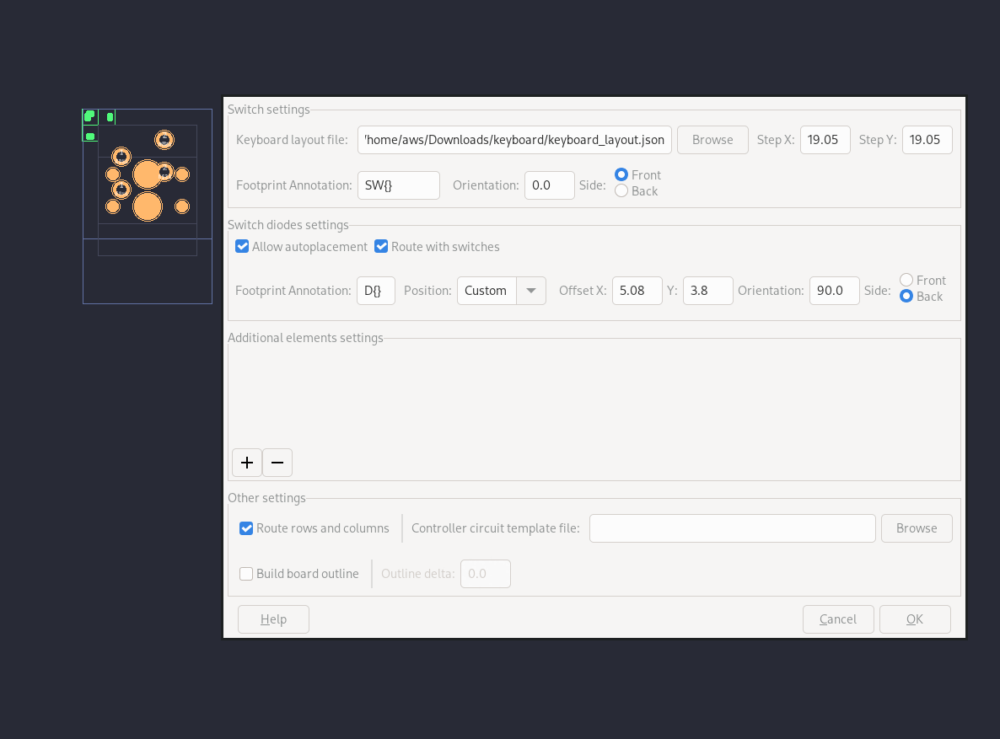
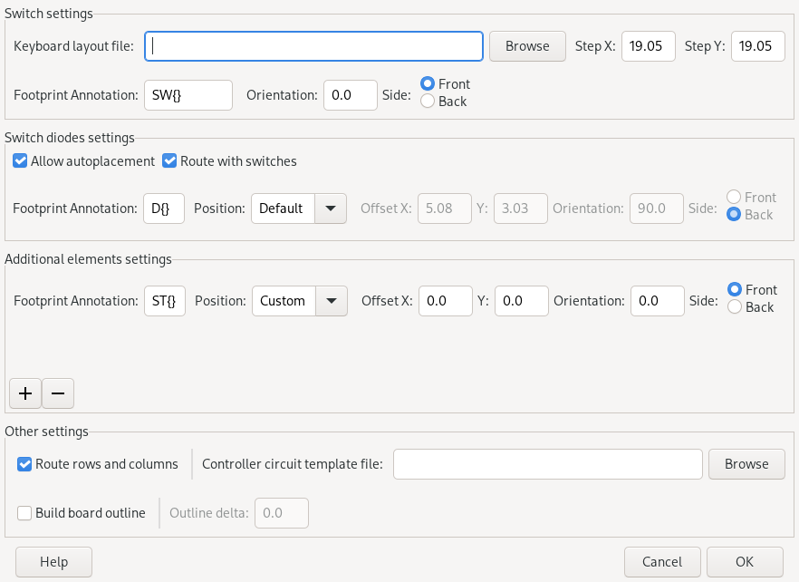

# kicad-kbplacer

[](https://circleci.com/gh/adamws/kicad-kbplacer/tree/master)

KiCad plugin for mechanical keyboard design. It features automatic key placement
based on popular layout description from [keyboard-layout-editor](http://www.keyboard-layout-editor.com/)

## Motivation

All PCB's for mechanical keyboards shares common properties which creates great
opportunity for scripting. Although this project does not aim to provide
complete automatic PCB generation tool it speeds up development process
by reducing tedious element placement task.

## Features

- [x] Automatic keys and diodes placement
- [x] Support for different annotation schemes
- [x] Basic track routing
- [x] Key rotation support
- [x] User selectable diode position in relation to key position



Some examples can be found in [examples](./examples) directory.

## Installation

To install release version of this plugin, use KiCad's `Plugin and Content Manager` (available since version KiCad 6.0).


In order to work with latest version of plugin, checkout this repository and copy (or link)
content of `kbplacer` directory to one of the KiCad's plugin search paths.
For more details see [this](https://dev-docs.kicad.org/en/python/pcbnew/) guide.

After installation, plugin can be started by clicking plugin icon on the toolbar:


or selecting it from `Tools -> External Plugins` menu.

## How to use?

### Direct usage

- Create switch matrix schematic which meets following requirements:
  - Each switch has dedicated diode with same annotation number
  - Symbols are ordered by Y position
  - Diodes are column-to-row configuration (COL = Anode, ROW = Cathode)

  

- Create new PCB and load netlist
- Obtain [kle-serial](https://github.com/ijprest/kle-serial) compatible layout
  json file (**note**: this is not json which can be downloaded directly from [keyboard-layout-editor](http://www.keyboard-layout-editor.com/)
  website. Expected json format can be seen in `examples` directory.

  For conversion you can use [https://adamws.github.io/kle-serial](https://adamws.github.io/kle-serial/)
  or [keyboard-tools.xyz/kle-converter](http://keyboard-tools.xyz/kle-converter)
- Run `kicad-kbplacer` plugin
- Select json layout file and plugin options and click OK.

  

#### Diode placement and routing

By default diodes are placed like shown below. This placement may not work for all switch and diode
footprints combinations.

Before | After
--- | ---
 | 

To use custom diode position there are two available options. Either select `Custom` in `Position` dropdown
and define `X/Y offset`, `Orientation` and `Front` or `Back` side:

  

or manually place `D1` diode to desired position in relation to first switch and run plugin with
`Current relative` `Position` option selected.

  

Remaining switch-diode pairs will be placed same as the first one.

Before | After
--- | ---
 | 

Some custom diodes positions may be to difficult for router algorithm.
In the above example it managed to connect diodes to switches but failed to connect diodes together.

Switch-to-diode routing is not done with proper auto-routing algorithm and it is very limited.
It attempts to create track in the shortest way (using 45&deg; angles) and doesn't look for other options
if there is a collision, leaving elements unconnected.

If first switch-diode pair is routed before plugin execution, as shown below, `kicad-kbplacer` instead of
using it's built in routing algorithm, will copy user's track. This allow to circumvent plugin's router
limitations. This is applicable only for `Current relative` `Position` option.

Before | After
--- | ---
 | 

#### Additional elements placement

In case additional elements need to be automatically placed next to corresponding switches (for example
stabilizer footprints if not integral part of switch footprint, or RGB LEDs), define entries
in `Additional elements settings` section. It behaves very similarly to switch diodes options with few exceptions:

- there is no default position defined
- when footprint not found, algorithm proceeds. There is no 1-to-1 mapping required
- there is no track routing

#### Demo project

For example demo project see `demo` directory. This project contains 4x4 switch matrix with
already generated layout json file (`kle_internal.json`) in expected by plugin format.
It requires [keyswitch-kicad-library](https://github.com/perigoso/keyswitch-kicad-library) to be installed.
Use this project to validate plugin installation.

### As a service

This plugin is part of my another project. See [keyboard-tools](https://github.com/adamws/keyboard-tools)

## Troubleshooting

### Plugin does not load

If plugin does not appear on the `Tools -> External Plugins` menu and its icon is missing on toolbar,
launch python scripting console `Tools -> Scripting Console` and type:

```
import pcbnew
pcbnew.GetWizardsBackTrace()
```

This should return backtrace with an information about the fault. Include this information in bug report.

### Plugin misbehaves or crashes

- Read stacktrace in error po-pup
- See `kbplacer.log` file, created in PCB directory

For bug reports please use [this template](https://github.com/adamws/kicad-kbplacer/issues/new?template=bug_report.md).

