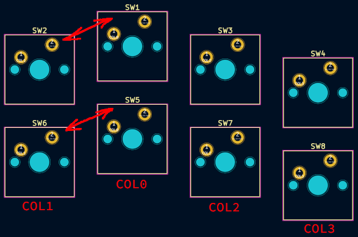
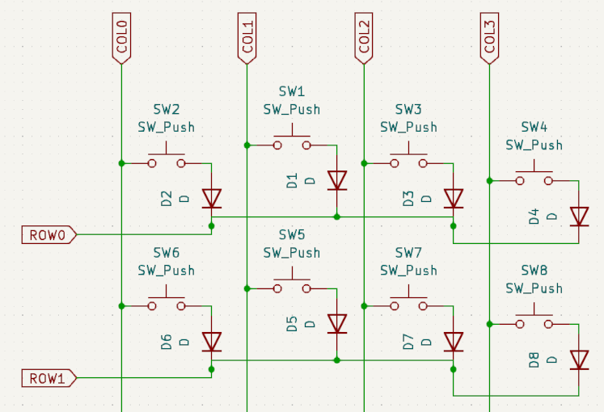
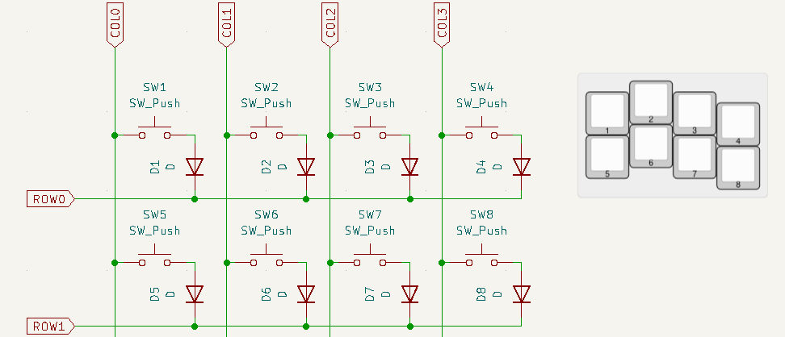
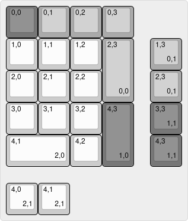
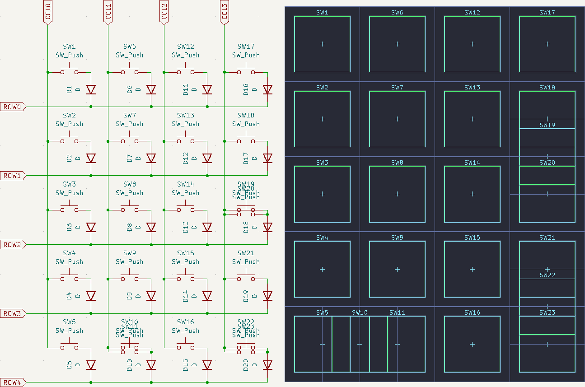

# Annotation guide

Since [keyboard-layout-editor](http://www.keyboard-layout-editor.com/) layout
files contain only informations about the key location and its
appearance (like size, color and labels) the `kbplacer` plugin
must use some assumptions in order to find corresponding
footprints on the PCB.

This guide explains the process, show common problems and describes
possible solutions.

## Common scenarios

### Schematic order matches KLE key order

Following example show schematic and KLE image
with key labels which represent internal KLE ordering.

This is the simplest case which should not require any adjustments
as long as KiCad symbols are sorted by Y position.
The `kbplacer` plugin process keys in KLE order, which in this example
matches schematic ordering. This will be the case for
ortholinear and row staggered keyboards.

### Schematic order does not match KLE key order

Let's consider column staggered keyboard layout with same schematic
as in previous chapter.

Note that keys in KLE picture are in different order now.
That's because KLE uses topmost leftmost sorting.
Since `kbplacer` uses KLE order the placement on the PCB board would
be wrong:

In this simple example, only the order of two first columns
would be wrong but the effect might be amplified with more
complicated ergo layouts.

There are two ways to ensure matching order between schematic and KLE:

1. Adjust elements placement on the schematic to resemble physical layout
   of the switches. This way KiCad Y position annotation assignment will match
   KLE behaviour. Key matrix on the schematic is usually drawn
   in uniform grid for readability, this solution might be suitable for simple
   column staggered designs:

   

   Changing annotations by hand would also work but it is prone to breaking when
   running KiCad automatic re-annotation with `Keep existing annotations`
   option disabled.

2. Define expected annotation in KLE layout. This is called `explicit annotation`
   mode by `kbplacer`.

   If **all of the switches** in the provided layout file
   have digit-only front center label defined, then these numbers will used
   for searching footprints, for example:

   

   Note that labels in previous examples were used only for demonstrating
   how keys are ordered by KLE. If user specifies front center labels like
   in the above picture, then it takes priority over default (KLE) ordering.
   The front center label has been chosen because it is unlikely that it
   interferes with already defined layouts.

## Using VIA annotated layouts

The `kbplacer` automatically detects and handles [VIA](https://www.caniusevia.com/docs/layouts) layouts
and raw KLE layouts with via-like matrix coordinates labels.
When such file provided, then the annotations on the schematic can be out of order
because `kbplacer` will search for footprints using net names derived from
defined `row,col` key legend.

This solves the problem of missing layout to schematic mapping.

The only requirement is that rows and columns **must** use one of the following
names: `R, ROW, C, COL, COLUMN` (case insensitive).

### Layout options

The VIA supports multiple layout options for physical layout of keys.
This is supported by `kbplacer` as well. Consider following example:

[(open in keyboard-layout-editor)](http://www.keyboard-layout-editor.com/##@@_c=%23777777%3B&=0,0&_c=%23aaaaaa%3B&=0,1&=0,2&=0,3%3B&@_c=%23cccccc%3B&=1,0&=1,1&=1,2&_c=%23aaaaaa&h:2%3B&=2,3%0A%0A%0A0,0%3B&@_c=%23cccccc%3B&=2,0&=2,1&=2,2%3B&@=3,0&=3,1&=3,2&_c=%23777777&h:2%3B&=4,3%0A%0A%0A1,0%3B&@_c=%23cccccc&w:2%3B&=4,1%0A%0A%0A2,0&=4,2%3B&@_x:4.5&y:-4&c=%23aaaaaa%3B&=1,3%0A%0A%0A0,1%3B&@_x:4.5%3B&=2,3%0A%0A%0A0,1%3B&@_x:4.5&c=%23777777%3B&=3,3%0A%0A%0A1,1%3B&@_x:4.5%3B&=4,3%0A%0A%0A1,1%3B&@_y:0.5&c=%23cccccc%3B&=4,0%0A%0A%0A2,1&=4,1%0A%0A%0A2,1)

This layout uses three 2U keys which can be independently replaced with two 1U keys instead.
Schematic for such keyboard and resulting PCB should look something like this:

Note that keys for nets `2,3`, `4,1` and `4,3` are doubled. The alternative keys
are automatically 'collapsed' into proper physical place so there is no need to adjust
any position on above layout.

Because layout provides mapping between switch (on layout) and its footprint, the schematic
annotations can be sorted by X position (or not sorted at all).
